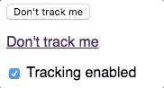

# Trackless

## Let your users opt-out of Google Analytics

Google Analytics is super-useful, but lots of people don't like being tracked.
The GDPR says that users should be able to choose whether they share personal
information. This script lets you easily give your site visitors a way of
opting-out of Google Analytics tracking. This preference is stored in the
browser's localStorage.



Tracking is disabled by setting `window['ga-disable-GA_TRACKING_ID'] = true;`,
as documented
[here](https://developers.google.com/analytics/devguides/collection/gtagjs/user-opt-out).
This needs to be done before the Google Analytics call is made, so the script
should be loaded before the Google Analytics script.

## How to use

[](https://www.npmjs.com/package/trackless)
[](https://github.com/ascorbic/trackless/issues)

The script can either be loaded as a module if you are using a bundler, or
directly from a script tag.

To load as a package, install from NPM:

```sh
npm install trackless
```
or
```sh
yarn add trackless
```
Then in your source file:
```js
import { Trackless } from "trackless";

const trackless = new Trackless({ trackingID: "MY_TRACKING_ID" });
trackless.bindElements();
```

When loading from a script tag, place it in the head before your GA tag. We use
the same method as GA for loading asynchronously, so its safe to load it in the
head. You can either load it directly from unpkg.com, or [download the UMD file](https://unpkg.com/trackless) and host it yourself.

```html
<script async src="//unpkg.com/trackless@1"></script>
<script>
    window.TracklessQueue = window.TracklessQueue || [];
    TracklessQueue.push(
        function (Trackless) {
            new Trackless({ trackingID: "MY_TRACKING_ID" }).bindElements();
        }
    )
</script>
```

By default it binds to all elements with the class "trackless". You can change
this by passing a different selector to `bindElements()`. e.g.
`bindElements("button.optOut")` will bind to all buttons with the class
"optOut". You can click any bound element to toggle the preference. This will
automatically update the setting in localStorage, as well as the label for
itself and all other bound elements. For checkboxes, it updates the checked
value. For other `<input>` elements it sets the `value` property. For all other
elements, it sets the innerText.

[Demo](https://unpkg.com/trackless/demo/index.html)

## API

### Options

The following options can be assed to the constructor. All fields are optional, except trackingID.

| Param          | Type       | Default           | Description                                                                                                                                                                                     |
| -------------- | ---------- | ----------------- | ----------------------------------------------------------------------------------------------------------------------------------------------------------------------------------------------- |
| trackingID     | `string`   | -                 | Your Google Analytics tracking ID. e.g. GA-XX-XXXXX                                                                                                                                             |
| optOutText     | `string`   | "Don't track me"  | The text prompting the user to opt out.                                                                                                                                                         |
| optInText      | `string`   | "Enable tracking" | The text prompting the user to opt in.                                                                                                                                                          |
| initialOptOut  | `boolean`  | false             | Initial opt-out value if no preference is stored.                                                                                                                                               |
| overrideOptOut | `boolean`  | false             | Override opt-out value. If true, sets the stored preference to the `initialOptOut` value.  Use this if, for example, you have a logged-in user and want to sync the preference between devices. |
| callback       | `Function` | -                 | Called when opt-out value is changed. Passed the new opt-out value.                                                                                                                             |
| invertCheckbox | `boolean`  | false             | Invert the behaviour of checkboxes. By default, a checkbox is checked if the user is not opted-out. Set this to true so that it is checked if the user is opted-out.                            |

### The Trackless object

### constructor(options) 


| Param   | Type      | Description        |
| ------- | --------- | ------------------ |
| options | `Options` | An options object. |


### bindElements(selectors)
Adds onClick listeners to the selected elements, and sets their value according to the current preferences.  

| Param     | Type     | Description                                                                                                 |
| --------- | -------- | ----------------------------------------------------------------------------------------------------------- |
| selectors | `string` | The selectors of the elements to bind. Default is `".trackless"`, i.e. any element with `class="trackless"` |

### unBindAllElements()
Unbinds all previously bound elements.

### setPreference(optOut)
Sets the opt-out preference, stores the value in localStorage, and updates all elements. If `callback()` is set then it is invoked with the new value.

| Param  | Type      | Description      |
| ------ | --------- | ---------------- |
| optOut | `boolean` | The optOut value |


### `static` processQueue(queue)

Used by the async loader to run queued commands. You shouldn't need to use this yourself unless you are handling your own queue. It should be an array of functions, which are passed the `Trackless` class. The UMD file looks for a `window.TracklessQueue` array, which it passes to this when the script has loaded. If you are loading it as a module you won't get this behaviour, so if you need async processing then this is the way to implement it.
```js
Trackless.processQueue(window.TracklessQueue);
```

| Param | Type    | Description                                                                         |
| ----- | ------- | ----------------------------------------------------------------------------------- |
| queue | `array` | An array of callbacks. These are passed the `Trackless` class as the only argument. |

## FAQ
- **Does this stop the Analytics script from loading?**
No. The script still loads. However because the opt-out flag is set, Google does not set a cookie or track the visit.
- **Should I default to opted-out?** I am not a lawyer, but if you want to be totally sure then yes, pass `initialOptOut: true` in the options and it will default to opted-out, and not track the user unless they positively opt in. 
- **Is this required by the GDPR?** I am not a lawyer. Google allows you to anonymise IP addresses in Analytics (which you should absolutely do), but it still tracks the user via a client ID. It could certainly be argued that this is PII (and I expect some lawyers will be doing just that).